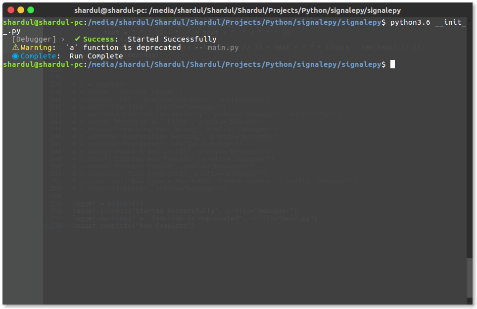
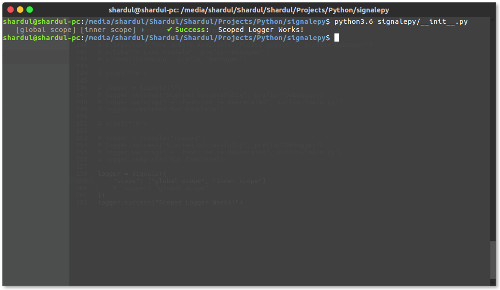
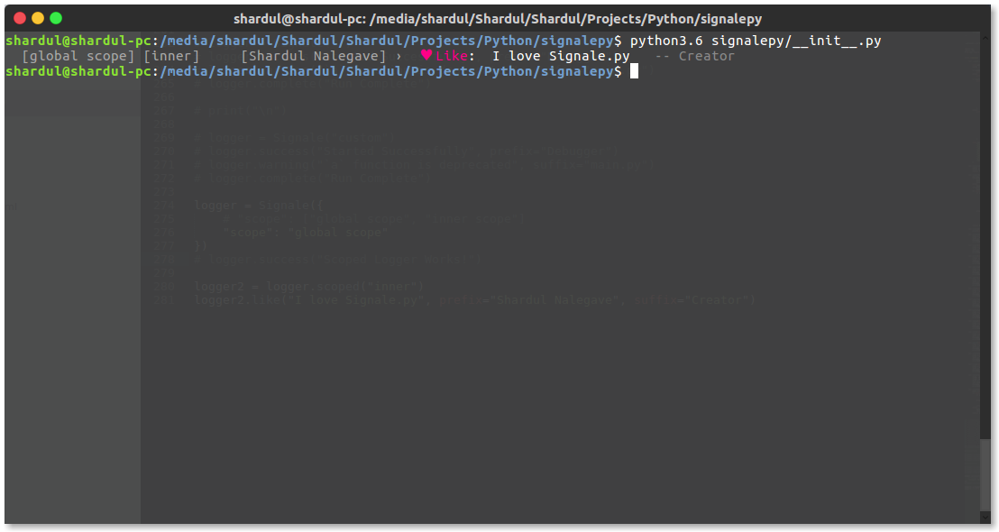
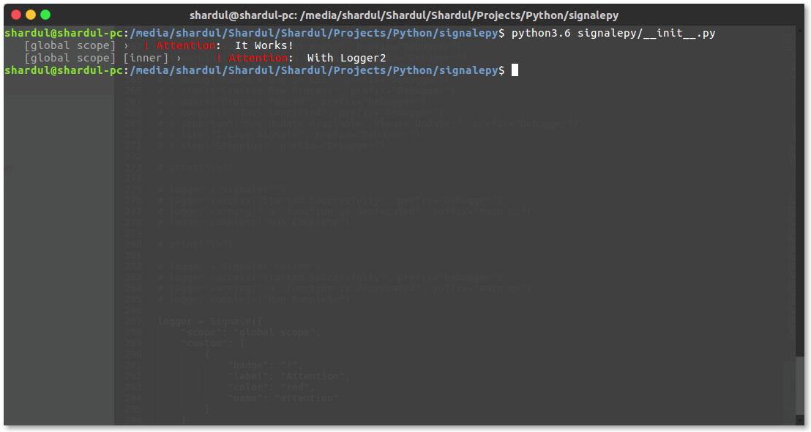
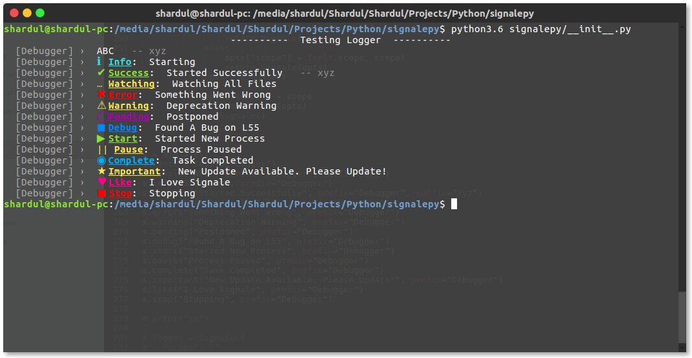

<div align="center">
	<h1 align="center">Signale.py</h1>
	<p align="center">Elegant Console Logger For Python Command-Line Apps</p>
	<br>
	<br>
	
</div>

<hr>


## Installation
**Signale.py** can be installed using pip.

````bash

    [sudo] pip install signalepy

````


## Usage
Package consists of a class `Signale`, it is the main constructor class. The object created has all the logger functions in it.


### Using Loggers
Each logger function takes in three arguments:-
- `text`
- `prefix` ( Optional )
- `suffix` ( Optional )

They all are available in the logger object. To create one do this:-
````python

from signalepy import Signale

logger = Signale()

````

Now you can use the default loggers using this object like:-
````python

...

logger.success("Started Successfully", prefix="Debugger")
logger.warning("`a` function is deprecated", suffix="main.py")
logger.complete("Run Complete")

...

````


This will produce the following result:-

<div align="center">
	
</div>

<br><br>

<details>
	<summary>View All Available Loggers</summary>

- `simple`
- `success`
- `error`
- `warning`
- `start`
- `stop`
- `watch`
- `important`
- `pending`
- `complete`
- `debug`
- `pause`
- `info`
- `like`
- `center`

</details>


----------------------------------------------------------------------------------------------------------


## Scoped Loggers
To create scoped loggers, define the `scope` field in the `options` argument of constructor like:-

````python

from signalepy import Signale

logger = Signale({
	"scope": "global scope"
})
logger.success("Scoped Logger Works!")

````

This will produce the following result:-

<div align="center">
	
</div>

<br><br>

You also create multiple scopes by setting the `scope` field to a list of strings like:-

````python

from signalepy import Signale

logger = Signale({
	"scope": ["global scope", "inner scope"]
})
logger.success("Scoped Logger Works!")

````

This will produce the following result:-

<div align="center">
	
</div>

<br><br><br>

You can also create scoped a logger which is just clone of other by using by using the `scoped` function like this:-

````python

from signalepy import Signale

logger = Signale({
	"scope": "global scope"
})

logger2 = logger.scoped("inner")
logger2.like("I love Signale.py", prefix="Shardul Nalegave", suffix="Creator")

````

This will produce the following result:-

<div align="center">
	
</div>

<br>

**Note:-** All the configuration will be copied to the new logger just the scope will be extended.


----------------------------------------------------------------------------------------------------------


## Custom Loggers
Custom loggers can be created by passing a array of custom logger configuration to the field `custom` in the options passed to the constructor. Even clone loggers inherit the parent's custom loggers. For example:-

````python

from signalepy import Signale

logger = Signale({
	"scope": "global scope",
	"custom": [
		{
			"badge": "!",
			"label": "Attention",
			"color": "red",
			"name": "attention"
		}
	]
})

logger2 = logger.scoped("inner")

logger.attention("It Works!")
logger2.attention("With Logger2")

````

This will produce the following result:-

<div align="center">
	
</div>

----------------------------------------------------------------------------------------------------------


## Underlined Labels
You can set labels to be underlined by setting the `underlined` field to `True` in the options passed to the constructor. For example:-

````python

from signalepy import Signale

s = Signale({
	"underlined": True
})
s.center("Testing Logger")
s.simple("ABC", prefix="Debugger", suffix="xyz")
s.info("Starting", prefix="Debugger")
s.success("Started Successfully", prefix="Debugger", suffix="xyz")
s.watch("Watching All Files", prefix="Debugger")
s.error("Something Went Wrong", prefix="Debugger")
s.warning("Deprecation Warning", prefix="Debugger")
s.pending("Postponed", prefix="Debugger")
s.debug("Found A Bug on L55", prefix="Debugger")
s.start("Started New Process", prefix="Debugger")
s.pause("Process Paused", prefix="Debugger")
s.complete("Task Completed", prefix="Debugger")
s.important("New Update Available. Please Update!", prefix="Debugger")
s.like("I Love Signale", prefix="Debugger")
s.stop("Stopping", prefix="Debugger")

````

This will produce the following result:-

<div align="center">
	
</div>


----------------------------------------------------------------------------------------------------------


## Options
Options taken by constructor

1. `scope`

	<br>
	
	- Type: `str` or `list`

	Signale Logger Scope

	<br><br>

3. `underlined`

	<br>

	- Type: `bool`

	Labels Should Be Underlined Or Not

2. `custom`

	<br>

	- Type: `list`

	List of custom logger configuration.

	- Configuration Type: `dict`

		Custom Logger Configuration Dictionary

		- Keys

			1. `name`

				- Type: `str`

				Name of the logger

			2. `label`

				- Type: `str`

				Label displayed beside the icon ( colored text )

			3. `badge`

				- Type: `str`

				Icon

			4. `color`

				- Type: `str`

				Color of the icon and label. Should be from:-

				- `red`
				- `dark`
				- `very light blue`
				- `pink`
				- `green`
				- `grey`
				- `purple`
				- `yellow`
				- `cyan`
				- `reset` (color reset code)

	<br><br>


----------------------------------------------------------------------------------------------------------


## API

1. logger = `Signale(<options>)`

	<br>

	`Signale`

	- Type: `class`

	Signale class imported from `signalepy` module

	<br>

	`options`

	- Type: `dict`

	Options Dictionary for logger.

	<br>

	- Returns: Signale Logger Object

	Logger object which can be used for logging

	<br><br>

2. logger.`<logger>(message="", prefix="", suffix="")`

	<br>

	`logger`

	- Type: `function`

	Can be any default logger

	<br>

	`message`

	- Type: `str`

	Message to be displayed

	<br>

	`prefix`

	- Type: `str`
	- Required: False

	Prefix text

	<br>

	`suffix`

	- Type: `str`
	- Required: False

	Suffix text

	<br>

	- Returns: `None`

	<br><br>

3. logger2 = `logger`.scoped(`<new scope>`)

	<br>

	`logger`

	- Type: Signale Logger Object

	Parent Logger

	<br>

	`new scope`

	- Type: `str`

	New Scope Name

	<br>

	- Returns: Signale Logger Object

	Clone Logger object with extended scope

	<br><br>


----------------------------------------------------------------------------------------------------------


**Licensed Under [MIT License](https://github.com/ShardulNalegave/signale.py/blob/master/LICENSE)**
**A Project By [Shardul Nalegave](https://shardul.netlify.com)**